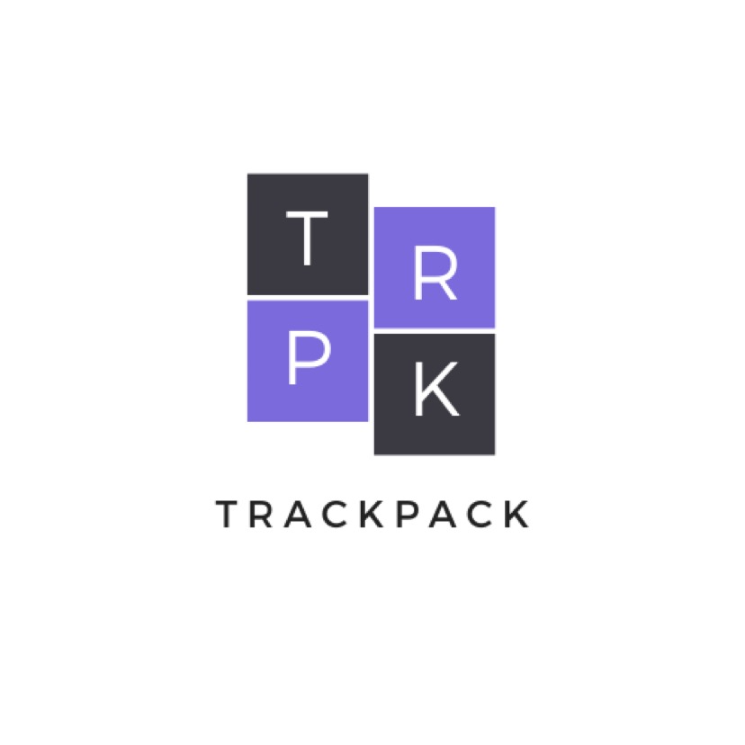

<!-- PROJECT LOGO -->
 

  
  <h3 align="center">TrackPack</h3>
  

    TrackPack is the all-in-one mobile app that updates users on the statuses of all their packages. This platform uses an API within Android Studio to request shipment data from over 15 different postal carriers, giving you the shipment details you need, all in one place.
     
    <a href="https://github.com/hanniyazohdi/track-it"><strong>Explore the docs »</strong></a>
     
     
  

<!-- TABLE OF CONTENTS -->

  
<h2 style="display: inline-block">Table of Contents</h2>

  <ol>
    <li>
      <a href="#about-the-project">About The Project</a>
      <ul>
        <li><a href="#built-with">Built With</a></li>
      </ul>
    </li>
    </li>
    <li><a href="#usage">Usage</a></li>
    <li><a href="#roadmap">Roadmap</a></li>
    <li><a href="#acknowledgements">Acknowledgements</a></li>
  </ol>

<!-- ABOUT THE PROJECT -->
## About The Project

[![TrackPack]](https://github.com/hanniyazohdi/track-it)

TrackPack is the all-in-one mobile app that updates users on the statuses of all their packages. This platform uses an API within Android Studio to request shipment data from over 15 different postal carriers, giving you the shipment details you need, all in one place.

### Built With

* Android Studio
* Shipit API

<!-- USAGE EXAMPLES -->
## Usage

TrackPack incorporates a Shipit API that updates the user on its delivery status by inputting its "Tracking Number" and "Postal Carrier" and one click of a button! The most recent packages tracked will show up on the dashboard screen and display its delivery status!

TrackPack's features can help the user:

* Save time and stay organized with incoming and outgoing packages
* Reduce the chance of losing packages
* Stay updated on all of its packages in one convenient location: an app in your phone!

_For more information, please refer to the [Documentation](https://github.com/hanniyazohdi/track-it)_

<!-- ROADMAP -->
## Roadmap

* Open app
* New order: User types in tracking number and postal carrier
* Data is then saved on the dashboard and can continue to be updated through the dashboard

<!-- ACKNOWLEDGEMENTS -->
## Acknowledgements

* [Back-end Programmer: Hanniya Zohdi](https://www.linkedin.com/in/hanniya-zohdi/)
* [Front-end Programmer: Aevery Tam](https://www.linkedin.com/in/aeverytam/)
* [Ada Apprentice: Hailey Duong](https://www.linkedin.com/in/haileyduong/)
* [Designer: Maddy Gander](https://www.linkedin.com/in/madelyngander/)